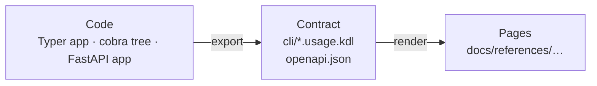

# About generated, drift-checked docs

Reference documentation has a peculiar weakness: it is a **second copy** of
facts that already live in the code. A flag's name, its default, the shape
of an endpoint's response: all of it is decided in source files and then
re-typed into prose. The two copies drift the moment someone changes the
first and forgets the second, and nothing tells anyone.

docs-kit's answer is to stop keeping two copies. The reference is **derived**
from the code, and a check proves the derivation is current.

## From code to contract to page

Generation happens in two steps, with a committed file in the middle:

The intermediate **contract** is the interesting part. It is a
machine-readable description of the interface (a [Usage](https://usage.jdx.dev)
spec for a CLI, an OpenAPI document for an HTTP API), and it is committed to
git next to the code. That buys three things:

- **Interface changes become visible in review.** A pull request that renames
  a flag shows a one-line change in `cli/mycli.usage.kdl`, separate from the
  hundreds of lines of implementation around it. Reviewers see the contract
  change, not just the code change.
- **Rendering doesn't need the application.** Pages, man pages and shell
  completions are produced from the contract alone; nobody has to build a Go
  binary or install a Python package to render them.
- **One pipeline for every language.** Once a Typer app and a cobra tree are
  both reduced to Usage KDL, everything downstream is shared.

The contract is still generated, never hand-edited. What the code cannot
express (exit codes, environment settings, curated examples) goes into a
separate, hand-written `.usage.extra.kdl` that is merged in. The boundary
between "derived" and "authored" stays a file boundary.

## Why byte-stability matters

The drift gate is, at heart, a diff: regenerate what the code implies,
compare it with what is committed. That only works if regenerating
unchanged inputs produces **identical bytes**.

So the generators are deliberately boring. Paths, methods and schema
properties are sorted; there are no timestamps; two semantically equal
OpenAPI documents with different key order render the same page. A diff
that appears is a diff that means something.

Without that property, every refresh would produce noise, people would learn
to commit whatever the tool wrote, and the gate would stop being a signal.

## Check never writes, refresh always does

The two verbs are kept strictly apart:

- `refresh` rewrites the whole generated set. Humans run it, look at the
  diff, and commit.
- `check` computes the same set in memory and only compares. CI and hooks
  run it.

A hook that silently regenerated and staged the docs would be more
convenient, and it would hide exactly the change a reviewer should see. The
pre-commit recipe is therefore check-only: it blocks, prints the fix, and
lets you decide.

## Three kinds of files

docs-kit is precise about who owns what, because a tool that overwrites your
writing is a tool you stop running.

Generated
:   Owned by docs-kit, rewritten by `refresh`, compared by `check`: the CLI
    contracts and pages, the four API files, the GitHub workflow, and (in
    dependency mode) the marked task block in `mise.toml`. Editing them by
    hand is always wrong, and `check` says so.

Scaffold
:   Written **once** by `init` (`zensical.toml`, the home page, the CLI
    standard page) and yours from then on. `init` re-run later skips
    identical files and refuses to touch ones you changed unless you pass
    `--force`.

Authored
:   Everything else: your tutorials, guides and explanation. docs-kit never
    reads or writes them.

The full list is in [Repository layout](../references/repository-layout.md).

## Why the other three quadrants stay human

The scaffold organises the site along [Diátaxis](https://diataxis.fr):
tutorials, how-to guides, explanation, reference. That split is what makes
generation safe to adopt. Reference is the one quadrant that is *meant* to
mirror the machinery, austere and complete, so it is the one a machine can
write faithfully. Tutorials, guides and explanation are about a reader's
goals and understanding; no contract contains them.

Generating the reference doesn't replace writing documentation. It removes
the part that rots, so the writing time goes to the parts only people can
do.

## The costs

The approach has trade-offs, and they are accepted on purpose:

- **Generated files live in git.** Diffs are larger and two branches that both
  change the CLI will conflict in the contract. The resolution is always the
  same: merge the code, run `docs:refresh`.
- **Help strings become user-facing documentation.** A terse `help="n"` now
  ships to readers. This is intentional pressure: the
  [CLI standard](../references/cli-standard.md) makes a missing help string
  a review failure.
- **CI needs the toolchain.** The gate runs mise, uv and `usage` on every
  pull request. The generated GitHub workflow handles that; other CI systems
  follow [a short recipe](../guides/gate-drift.md#on-other-ci-systems).
