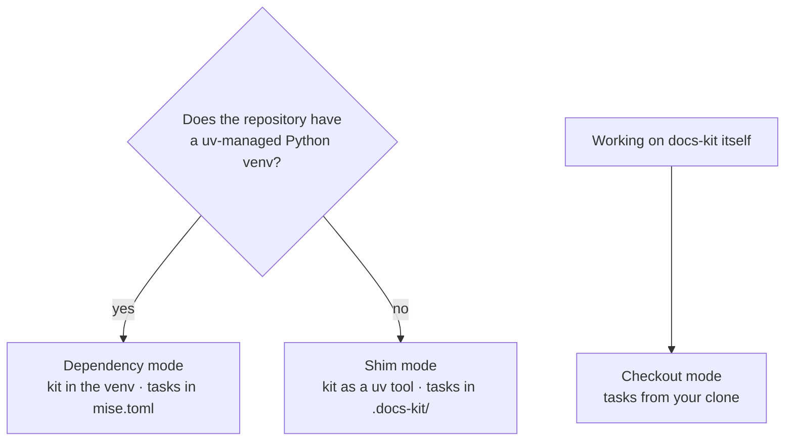
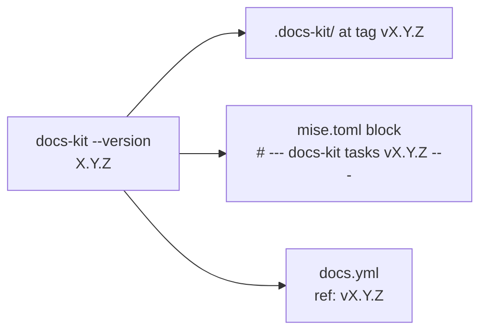

# About the install modes

Every `mise run docs:*` ends up running a docs-kit CLI. The install modes are
different answers to two questions: **where does that CLI come from**, and
**who pins its version**? The answers differ by repository, because a Python
project and a Go project have different things to offer.

## Dependency mode: the project pins the kit

In a Python repository, docs-kit is a dev dependency, like pytest.

The deciding reason is technical. To generate a Typer CLI's contract,
`docs-kit spec` must **import the app**, and it can only import what is
installed in its own environment. A globally installed docs-kit cannot see
your package; one installed in your venv can. Once that is true, the rest
follows naturally:

- `uv.lock` records the exact docs-kit commit, so every clone and every CI
  run uses the same version, and upgrades are explicit reviewed changes.
- The tasks can be trivial one-liners (`uv run docs-kit refresh`) because
  `uv run` always resolves the right CLI. Trivial tasks can be committed to
  `mise.toml`, so a fresh clone needs only `mise install && uv sync`.
- The committed block is **canonical**: `docs-kit check` compares it byte for
  byte with what the installed version would write. Every repository on the
  same version has the same tasks, and a stale block after an upgrade is
  caught rather than silently kept.

## Shim mode: the machine provides the kit

A Go repository has no Python venv to put docs-kit in, and adding one just
for docs would be an odd thing to ask. So the CLI is a `uv tool` on the
developer's `PATH`, and the repository itself commits nothing docs-kit
specific beyond the docs.

The tasks are harder here. They have to work whether or not the repository
defines `openapi` or `cli:spec` tasks, and fall back when `docs-kit` is not on
`PATH` (as on CI). Bodies like that don't belong pasted into someone's
config, so they ship as a **task layer**: the `shared/mise/` directory of the
docs-kit repository, fetched into `.docs-kit/` as a shallow sparse checkout.

Two details make the layer safe:

- **It is pinned to the CLI.** mise tasks carry no version of their own;
  they are plain TOML re-read on every run. So the layer is checked out at
  tag `v<docs-kit --version>`, and `docs-kit pull-tasks` re-pins it after an
  upgrade. CLI and task bodies always come from the same release.
- **It is opted into, not injected.** The three keys that include the layer
  live in `mise.local.toml`, which is git-ignored and auto-loaded by mise.
  docs-kit creates that file or appends to it only when the result is still
  valid TOML, and otherwise prints the block for you to paste. It never
  writes your committed `.mise.toml`.

The mechanism is mise's `[task_config].includes`. mise (as of 2026.9) has no
top-level "include another config file" key, which is why the layer is a task
file and the `usage` tool pin travels in the opt-in block instead.

The price is that the setup is per clone: `.docs-kit/` and `mise.local.toml`
are not in git, so each developer runs `docs-kit init --with-mise` once.

## Checkout mode: your clone is the kit

When you work on docs-kit, you want a consumer repository to run the task
bodies you are editing, not a released tag. Passing an **absolute** path
(`--docs-kit ~/Dev/docs-kit`) records the clone itself as the layer. Nothing
is fetched; `git pull` in the clone is the upgrade.

The rule that tells the modes apart is deliberately simple: a relative
`docs_kit` path is a layer to pull, an absolute one is a checkout to use as
is.

## One version everywhere

Whatever the mode, the same version number shows up in several places, and
they are kept in lockstep:

The GitHub workflow is the clearest case. A runner has neither your
`.docs-kit/` nor your `mise.local.toml`, so the generated `docs.yml` clones
docs-kit at a pinned tag and recreates the opt-in keys itself. That tag is
stamped from the CLI that generated the file. Bumping it by hand would let
CI run task bodies from a different release than your machine, so `check`
treats a hand-edited pin as drift.

## Why git refs instead of PyPI

docs-kit is installed from its git repository, and a tag is the pin. The
`latest` branch is force-moved to each release tag only after the release's
wheel is attached, so `@latest` never exposes unreleased commits from `main`.

This keeps one source of truth for three consumers that must agree: the
Python package, the `shared/mise/` task layer, and the CI workflow's
`ref:`. All three are "the repository at tag `vX.Y.Z`".
