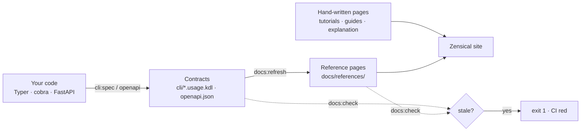

---
hide:
  - navigation
---

# docs-kit

**Reference docs that are generated from your code, and a build that fails when they go stale.**

docs-kit scaffolds a [Zensical](https://zensical.org) documentation site in
your repository, generates the reference pages from the contracts your code
already exposes (an `openapi.json`, a Typer or cobra CLI), and gives you one
command that CI and git hooks run to prove those pages still match the code.

```console
$ mise run docs:check
docs are NOT up to date:
  stale:   cli/hello.usage.kdl
run `docs-kit refresh` and commit the result.
```

## Key features

- **Generated reference, hand-written everything else.** API and CLI pages
  are rendered from `openapi.json` and [Usage](https://usage.jdx.dev) specs;
  tutorials, guides and explanation stay yours, in a
  [Diátaxis](https://diataxis.fr) layout.
- **A drift gate, not a reminder.** `docs-kit check` exits `1` when a
  generated page no longer matches the code behind it. Wire it into CI and
  pre-commit and stale docs stop merging.
- **Autodetected pipelines.** An `openapi.json` turns the API pipeline on; a
  Typer console script, `spf13/cobra` in `go.mod`, or a `cli/*.usage.kdl`
  turns the CLI pipeline on. No config file to learn.
- **Byte-stable output.** Regenerating unchanged inputs writes identical
  bytes, so a `git diff` is an honest signal.
- **mise-native.** A handful of tasks (`docs:refresh`, `docs:build`,
  `docs:serve`, `docs:check`, plus `cli:spec`) are the whole interface,
  locally and in CI.
- **Zero-secret CI on GitHub.** A generated Pages workflow checks pull
  requests and deploys `main`.

## Install at a glance

=== "Python project (uv)"

    docs-kit becomes a dev dependency; the `docs:*` tasks are committed to
    `mise.toml`.

    ```bash
    uv add --dev "docs-kit @ git+https://github.com/ldelarue/docs-kit.git@latest"
    uv run docs-kit init --with-mise --committed
    mise install && uv sync
    mise run docs:refresh && mise run docs:serve
    ```

=== "Go or any other repo"

    docs-kit is a uv tool on your `PATH`; the `docs:*` tasks are pulled into
    a git-ignored `.docs-kit/` layer.

    ```bash
    uv tool install --from "docs-kit @ git+https://github.com/ldelarue/docs-kit.git@latest" docs-kit
    docs-kit init --with-mise
    mise run docs:refresh && mise run docs:serve
    ```

Not sure which one applies, or want to pin a release tag?
[How to install docs-kit](guides/install.md) compares the options, and
[About the install modes](explanation/install-modes.md) explains why there
is more than one.

## How it fits together



The [CLI reference](references/cli/docs-kit.md) of docs-kit itself is
generated this way: this site is its own first consumer.
